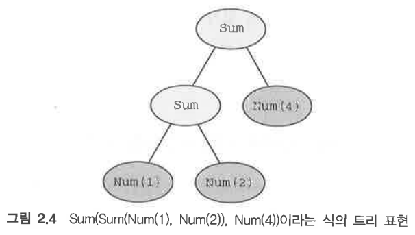
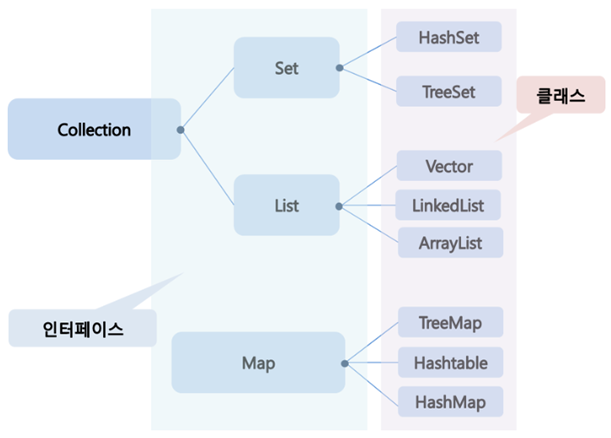

# 스마트 캐스트: 타입 검사와 캐스트를 조합
p83 ~

###간단한 산술식 (1+2)+4 계산하는 함수

~~~kotlin
interface Expr

// value 라는 프로퍼티만 존재하는 단순한 클래스로 Expr 인터페이스를 구현한다.
class Num(val value: Int) : Expr

// Expr 타입의 객체라면 어떤 것이나 sum 연산의 인자가 될 수 있다. 따라서 Num 이나
// 다른 Sum 이 인자로 올 수 없다.
class Sum(val left: Expr, val right: Expr) : Expr
~~~

  - Expr interface 에는 두 가지 구현 클래스가 존재한다. 따라서 두가지의 경우를 고려해야 한다.
  - 식이 숫자 라면 그 값을 반환한다. -> **Num class**
  - 식이 합계라면 좌항과 우항의 값을 계산한 다음에 그 두 값을 합한 값을 반환한다. -> **Sum class**

  - kotlin 키워드
    - is  : 변수 타입을 검사한다.
    - as : 원하는 타입을 명시적으로 캐스팅 해준다.

###1. 자바식 표현
~~~kotlin
   fun eval(e: Expr): Int {
    if(e is Num){ // is 는 변수타입을 검사하는 키워드
        //e의 타입이 Num인지 검사한 다음 컴파일러는 e의 타입을 Num 으로 해석한다.
        // 그렇기 때문에 Num의 value를 명시적 캐스팅 없이 e.value로 사용할 수 있다.
        // return e.value
        val n = e as Num // as 는 원하는 타입을 명시적으로 캐스팅 해주는 키워드이다.
        return n.value
    }
    if (e is Sum){
        // 변수 e에 대해 스마트 캐스트를 사용한다.
        return eval(e.right) + eval(e.left)
    }
    throw IllegalAccessException("Unknown expression")
}
~~~

##📌 정리
- 함수에 프로퍼티가 들어 왔을때 프로퍼티의 Type을 확인한다
  - if(x is Type) // 들어온 프로퍼티를 x 라가정하겠다.
  - x의 type 이 is 로 비교하는 Type와 같을 경우 컴파일러는 x 의 타입을 비교하는 Type와 같다고 해석한다.
  - 그렇기 때문에 Type 검사를 완료한 x 는 비교한 Type의 프로퍼티에 접근헤 사용할 수 있다. (즉, 스마트 캐스트)

###2. kotlin 식 표현
~~~kotlin
fun eval(e: Expr): Int =
    if (e is Num) {
        e.value
    } else if (e is Sum) {
        eval(e.right) + eval(e.left)
    } else {
        throw IllegalAccessException("Unknown expression")
    }
~~~

###3. if 중첩 대신 When 사용
~~~kotlin
fun eval(e: Expr): Int =
        when (e){
        is Num -> e.value      
        is Sum -> eval(e.right) + eval(e.left)
        else ->
            throw IllegalAccessException("Unknown expression")
        }
~~~

- 위 예제 처럼 class의 프로퍼티에 대해 스마트 캐스트를 사용한다면 그 프로퍼티는 반드시 val이어야 하며 커스텀 접근자를 사용한 것이어도 안된다.

### main
~~~kotlin
fun main() {
    println(eval(Sum(Sum(Num(1), Num(2)), Num(4))))
    println(eval(Sum(Num(1), Num(2))))
}
~~~

### if 와 when의 차지

#### 영어 단어로 비교
- if 는 '만약 ~~ 한다면'불확실한 상황을 가정 (가정법)
- when 은 '~할때' 의문사, 접속사 등 여러 경우에 쓰여진다.(상황)

#### code로 비교
- kotlin 에서의 if는 값을 return 키워드 없이 return(여러 줄일경우 마지막 값 리턴)을 할 수 있다.
- 삼항연산자 대신 if문을 사용하며 구현 할 수 있다.

- when 문은 swich 문 과 동일하다.
  - 리턴값을 가지는 용도라면 **모든 경우의 조건을 정의**해야한다.

### 분기에 복잡한 동작이 들어가 있는 when 사용하기
- if나 when 모두 분기에 블록을 사용할 수 있다(마지막 문장이 블록 전체의 결과).
- 예로 eval 함수에 로그(println 문)를 추가할 경우 {} 블록 처리를 해줘야한다.
~~~kotlin
import java.lang.IllegalArgumentException

fun evalWithLogging(e: Expr): Int =
    when (e) {
        is Num -> {
            println("num : ${e.value}")
            e.value
        }
        is Sum -> {
            val left = evalWithLogging(e.left)
            val right = evalWithLogging(e.right)
            println("sum:$left + $right")
            left + right
        }
        else -> throw IllegalArgumentException("Unknown expression")
    }

fun main() {
    println(evalWithLogging(Sum(Sum(Num(1), Num(2)), Num(4))))
}

/* 결과
    num : 1
    num : 2
    sum : 1 + 2
    num : 4
    sun : 3 + 4
    7
 */
~~~

- 블록 마지막 식이 블록의 결과 
- try 본문과 catch 절에서 마찬가지 규칙이 적용된다.
- 함수는 블록을 본문으로 가질수 없다.
- 블록이 본문인 함수는 내부에 return 문이 반드시 있어야 한다.

### 대상을 이터레이션: while과 for 루프

####이터레이터란?

- 자바의 컬렉션 프레임워크에서 컬렉션에 저장되어 있는 요소들을 읽어오는 방법을 표준화한 것이다.
- 컬렉션 프레임워크란 데이터를 저장하는 표준화 클래스들을 표준화 한 것이다.

####컬렉션 프레임워크
- 데이터를 저장하는 수조에따라 3가지 인터페이스로 구성
>

~~~kotlin
while (조건) { // 조건이 true일 경우 반복 실행
    /*...*/
}

do { // 맨 처음에 무조건 본문을 한번 실행한 다음, 조건이 참인동안 본물을 반복 실행
    /*...*/
}while (조건)

~~~

#### 수에 대한 이터레이션 : 범위와 수열

- 기존 java 의 for
>- 어떤 변수를 초기화하고 그 변수를 루프를 한번 실행할때마다 갱신하고 루프 조건이 거짓이 될때, 반복을 마치는 형태의 루프

- Kotlin
>- 범위(range)를 사용하며, 범위는 기본적으로 두 값으로 이루어진 구간이다.
>- 보통은 그 두 값은 정수 등의 숫자 타입이며, .. 연산자로 시작값과 끝 값을 연결해 범위를 만든다.

#### 피즈버즈 게임 구현
- 조건
  - 피즈버즈 게임 3으로 나누어 떨어지면 "피즈"
  - 5로 나누어 떨어지면 "버즈" 
  - 둘다 나눠지면 "피즈버즈"
  
- 다음 소스는 1부터 100까지의 피즈버즈 결과를 구하고. 인자가 없는 when을 사용해서 조건을 검사한다.
